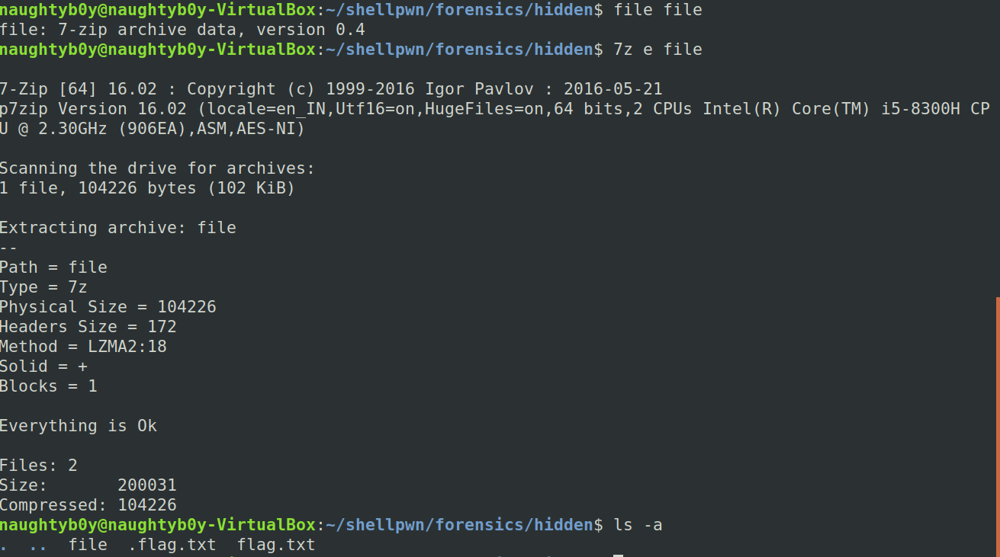
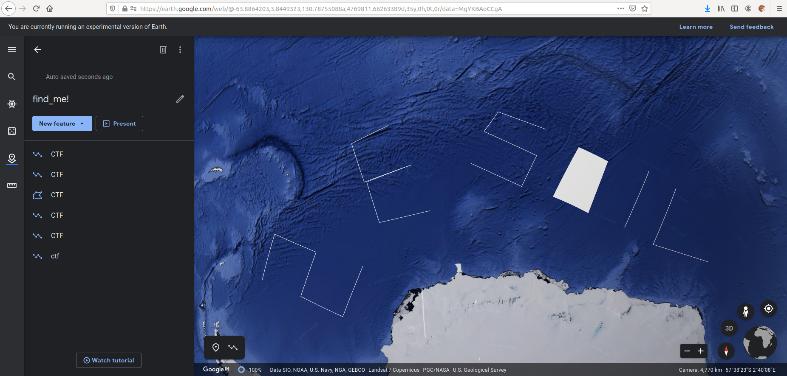

---

layout: post
title: Shellpwn CTF 2020 Writup
description: "Just a simple ctf writup"
date: 2020-02-29
feature_image: images/shellpwnctf/front.jpeg
tags: [CTF, Forensics, Scripting, Crypto]
published: true

---
<!--more-->
#                            Shellpwn2020


So I was able to solve only 7 challenges in the ctf and all the challenges were very intersting ,so lets start with the forensics challenges


## Forensics
### Challenge-Hidden!,200 

So we are given a file which is a 7z archive so we extract it and as the challenge name suggest *hidden* we look for hidden files in the extracted data and we get a .flag.txt file so we read it and get the flag



the flag is:-
```shellctf{l00k_d3ep_1n_b1n@rY} ```


### Challenge-Find me!,200

The xml file give is a kml file which is used to save the google earth configurations ,so on loading up the xml file in google cloud we get the flag


the flag was right there but there was confusion in chars so i faced a lot of time trying out the combinations 

finally the flag was
```shellctf{2E501L} ```

## Scripting

### Zipppppy,200
we are given with a file which is to extracted multiple times but the catch here is that everytime the file type is not same its different so we need to write a script to unzip it 
I wrote a bash script as its short and easy
```bash
#!/bin/bash

INPUT="$1"

FTYPE=`file ${INPUT}`

if [[ "$FTYPE" == *"POSIX tar"* ]]; then
    echo "TAR"
    tar -xOvf "$INPUT" > tmp
    cp tmp $INPUT
elif [[ "$FTYPE" == *"Zip archive data"* ]]; then
    echo "ZIP"
    unzip -o "$INPUT"
elif [[ "$FTYPE" == *"bzip2 compressed"* ]]; then
    echo "ZIP"
    bzcat "$INPUT" > tmp
    cp tmp $INPUT
elif [[ "$FTYPE" == *"gzip compressed data"* ]]; then
    echo "ZIP"
    zcat "$INPUT" > tmp
    cp tmp $INPUT
elif [[ "$FTYPE" == *"XZ compressed data"* ]]; then
    echo "ZIP"
    xzcat "$INPUT" > tmp
    cp tmp $INPUT
elif [[ "$FTYPE" == *"7-zip archive data"* ]]; then
    echo "7ZIP"
    7z e "$INPUT" -y 
else
    echo "NOT RECOGNIZED"
    echo ${FTYPE}
fi
```
and the run it like 

```bash
while true;do ./unpack.sh flag;done
```
SO the flag is 
```shellctf{$cr1ptiNg_I$_fUn} ```

### Fasst,250

Here we just have to send the md5 hash of the strings provided by the server so I writup a quick python script to get the flag 

```python 
from pwn import *
import hashlib
r=remote("134.209.149.171",4100)

def decode(str):
	str=str.strip()
	str=hashlib.md5(str)
	return str.hexdigest()

print(r.recv())
r.send("Y")
while(1):		
	str=r.recv()
	print(str)
	str=str[8:]
	str=str.strip()

	r.send(decode(str))

```

and we get the flag which is 
```shellctf{y0u_c@Ught_m3} ```


### Can you Escape me!,350

so being honest i was not able to solve the chall within the ctf period but after the ctf was over i was able to solve it with a little help from a friend so it was basically a ssh jail where some keywords or letters were restricted but when i kept on trying i saw that the command *uniq* was allowed but *flag.txt* was blacklisted 
easy way to get past this was to use *uniq flag.[a-z][a-z][a-z]*
it was showing command executed but i was not able to get the flag so i tried many things but it didn't work so with the help of a friend he told that the catch was to simply eval it :(

so the final payload was
``` eval `uniq flag.[a-z][a-z][a-z]` ```


the flag is 
```shellctf{b@$h_1s_$0_much_fUn} ```

##### Thanks @RudraPratap for the help

## Crypto 

### Powerbase,100

So basically we are given a multiple times base64 string we just have to decode it 

which can done using a python script like this one
```python
import base64

f=open("text.txt","r")
base_64=f.read()


for i in range(15):
	base_64=base64.b64decode(base_64)

print(base_64)
```

the flag is 
```shellpwn{enc0ding_i$_n0t_encrYpt1ng} ```


### Seive ,150

Its just a simple RSA problem which can be done using online tools or by solving manually ,I used a tool developed by my friend 
the link to the repo is <https://github.com/Masrt200/WoC2k19>Plz do check it out 


The flag is 
```shellctf{k3y_s1ze_m@tter$} ```